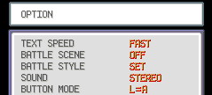

import { Pokemon, PokeMove } from '../components';

First of all, please go to the [Leaderboard](https://www.speedrun.com/pkmnfrlg) and read the rules of your category.

## Platforms

You can run the game on the GBA, DS, GCN (via GBP or [GBI](https://www.gc-forever.com/wiki/index.php?title=Game_Boy_Interface))
and the [mGBA Emulator](https://mgba.io/). However, emulator runs are **hidden** by default on the leaderboard
but this might change in the future. Refer to the leaderboard rules for emulator setup.

On the DS the game runs a bit slower at `59.6555` FPS (instead of `59.7275` FPS).
For a two hour run, this results in a timeloss of about 9 seconds.

## Game Versions

Runs can be done on the **English** or **Japanese** (different leaderboards) version of the game.

You can run both categories (Any% and Elite 4 Round 2) on either FireRed or LeafGreen.
However, there are some differences you might want to consider.

### Any%

Pokemon LeafGreen has <Pokemon name="Sandshrew" /> as version exclusive HM friend.
It can learn <PokeMove name="Strength" /> (and <PokeMove name="Cut" />) which saves a few seconds,
as you do not need to teach it to <Pokemon name="Blastoise" /> before the Victory Road.
This is the only version difference for this category and it is pretty **minor**.

### Elite 4 Round 2

Pokemon FireRed has **much** cheaper Game Corner prices making it the preferred version of this category
as money is very important in the run.

## Game Options

Before you start a run, load your current save file and make sure you have the following options:

Save the game after editing the options.
The `L=A` button mode allows you to mash through text by pressing A, B and L simultaneously.
